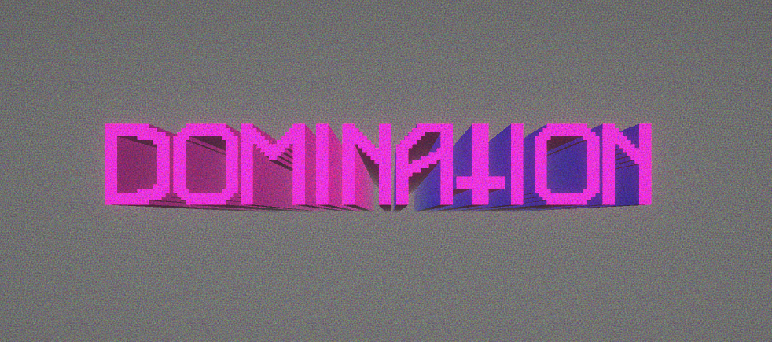
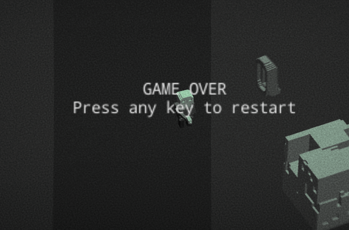

# Prototype 01: August 2017 #

## Dev Environment ##
Unity 3D 2017.1 - upgraded project to 2019.2 in Jan 2020
C#

# GDD #
I was thinking about keeping the first of these project at a super small scale in order to get a feel for what I can do in a month. But no.

## Title and theme: DOMINATION ##
I have been playing alot of over-the-top action games with RogueLike elements lately - the likes of *Nuclear Throne*, *Enter the Gungeon*, *BroForce*, etc.
The theme of domination stems from the skill-based mastery that makes these games fun (well, BroForce might be more mayhem than skill in many cases, but still fun). One might argue that this is on the far side of the masculine spectrum of fun & entertainment, in the sense mentioned by Jesse Schell in *Art of Game Design*, and Brett Leonard, the director of *Lawn Mower Man*, in his very interesting interview on *Voices of VR*: http://voicesofvr.com/406-building-storyworlds-with-lawnmower-mans-brett-leonard/. This might be interesting to flip on it's head somehow.
Also, I have this kind of itch to make a little game that is just super intense and metal all the time, that 14 year old me would love, so I'll just go all in on this one and get it out of my system. Hopefully.

## Genre ##
Realtime Action / Shooter Roguelite.

## Graphics ##
Top-down orthographic 3D - assets made in MagicaVoxel.

## Audio and music ##
Guns, guitars and synths.

## Core mechanics & features ##
- *Domination meter*: inspired by the Internalisation meter on the *IdleThumbs* twitch. Goes up whenever player hits something, goes down whenever player misses.
Player dies when meter is empty. Player wins if meter is filled to max. While meter is filling, simple upgrades might be unlocked, or weapons just get stronger. Music has at least two stems that are mixed according to Domination meter.
- *Player*: WASD movement, mouse aim and fire. 
- *Enemies*: super dumb zombie enemies that follow player - Unity NavMesh based "AI". Shoot/puke/something at player. Get faster as domination meter rises.
- *Environment*: simplest possible procedural level, obstacles are placed in otherwise very open wasteland. Enemy spawn points, spawn rate increases with Domination meter.
- *Weapons*: Player has gun that upgrades in some manner as Domination meter fills up. Enemies projectile vomit.

## Core design questions ##
- Can I turn the typical life/score meter into a mechanic that impacts all aspects of gameplay?
- Is it fun if a bullet hellish shooter punishes wasting shots and missing, while rewarding precision?

 

